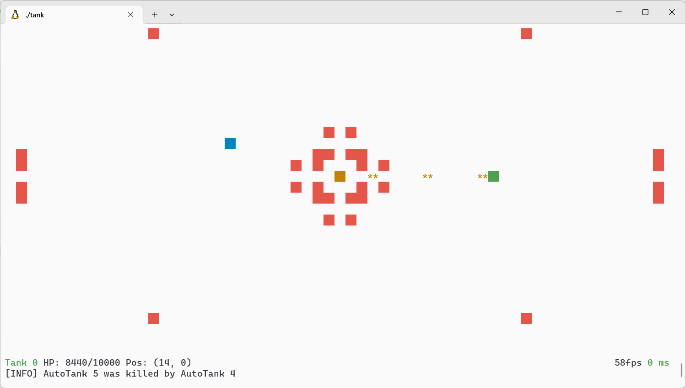
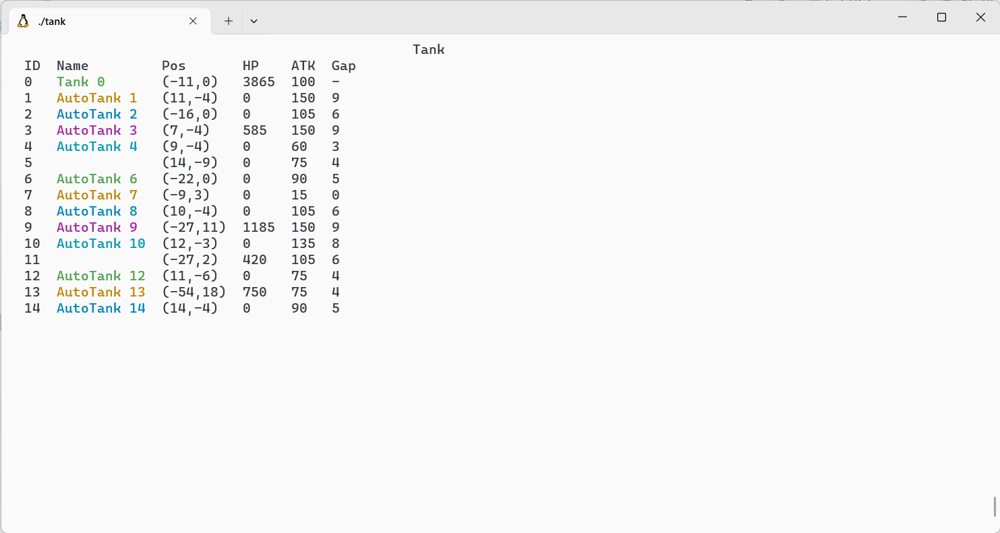

<h2 align="center">
Tank
</h2> 

<p align="center">
<strong>可联机的命令行游戏</strong>
</p>

### 简介

在 Tank 中，你将控制一辆坦克，在无尽的地图上展示你的战略才华(可以与在线联机)。

### 示例




### 教程

#### 控制

- 移动：WASD 或方向键
- 攻击：空格
- 查看坦克状态：“o”或“O”
- 输入命令：“/”

#### 坦克

玩家:

- HP: 10000, ATK: 100

人机:

- HP: (11 - lvl) * 150, ATK: (11 - lvl) * 15
- 坦克的等级越高，移动速度越快。

#### 命令

help [line]

- 获取此帮助。
- 使用“Enter”返回游戏。

quit

- 退出坦克。

pause

- 暂停游戏。

continue

- 继续游戏。

fill [Status] [A x,y] [B x,y optional]

- 状态： [0] 空 [1] 墙
- 用给定的状态填充A点到B点间的区域。
- B 默认与 A 相同
- 例如，fill 1 0 0 10 10 | fill 1 0 0

tp [A id] ([B id] or [B x,y])

- 将 A 传送到 B
- A 必须还活着，B 周围应该有空间。
- 例如, tp 0 1 | tp 0 1 1

revive [A id optional]

- 复活 A。
- 默认复活所有坦克。

summon [n] [level]

- 召唤具有给定等级的 n 辆坦克。
- 例如, summon 50 10

kill [A id optional]

- 杀死 A。
- 默认杀死所有坦克。

clear [A id optional]

- 清除 A.（仅限人机坦克）
- 默认清除所有人机坦克。

clear death

- 清除所有死亡的人机  
  注意： 清除是删除而不是杀死，所以清除的坦克无法复活。清除坦克的子弹将 也被清除。

set [A id] [key] [value]

- 设置 A 的属性(如下)：
- max_hp (int): A的最大 hp。在 A 复活时生效。
- hp (int): A 的 hp。立即生效，但在 A 复活后不会持续。
- target (id, int): 人机的目标。
- name (string): A的名字。

set [A id] bullet [key] [value]

- hp (int): A 子弹的 hp。
- lethality (int): A 子弹的杀伤力。（负数增加hp）
- range (int): A 子弹的射程。
- 例如, set 0 max_hp 1000 | set 0 bullet lethality 10  
  注意： 当子弹击中墙壁时，其hp会减 1。这意味着它可以反弹“hp - 1”次。

set tick [tick]

- tick (int, milliseconds): 游戏（或服务器）主循环的最短时间。

set msg_ttl [ttl]

- ttl (int, milliseconds): 消息的显示时间。

set seed [seed]

- seed (unsigned long long): 游戏地图的种子。

tell [A id optional] [msg]

- 向 A 发送消息。
- id 默认为 -1，此时所有玩家都将收到该消息。
- msg(string): 消息的内容。

observe [A id]

- 观察 A。

server start [port]

- 启动 Tank 服务器。
- port(int): 服务器监听端口。

server stop

- 关闭 Tank 服务器.

connect [ip] [port]

- 连接到 Tank 服务器。
- ip(string): 服务器的 IP。
- port(int): 服务器的端口。

disconnect

- 断开与服务器的连接。

### 编译

需要 C++ 20

#### CMake

```shell
mkdir build && cd build
cmake .. && make
```

#### G++

```shell
g++ src/* -I include -lpthread -O2 -std=c++20 -o tank
```
